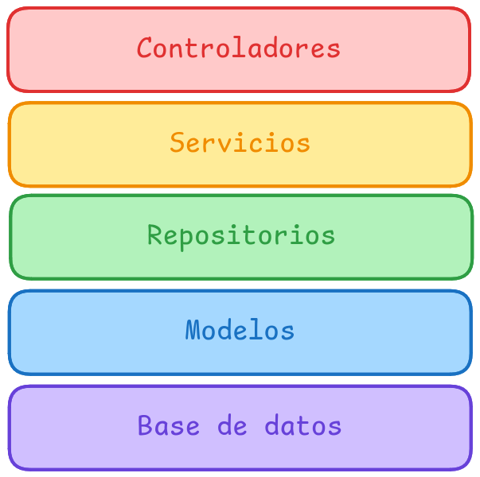

# 🌿 Arquitectura de Spring

La arquitectura de Spring es muy clara y esta muy bien definida, se debe seguir a raja tabla.

En Spring usaremos una arquitectura dividida en capas. Cada capa solo puede llamar a la capa inferior (o a su misma capa en caso de ser un servicio), es decir un controlador NUNCA llamará a un repositorio.

## Base de datos

Aqui se guardan los datos, en nuestro caso es PostgreSQL, nunca tocamos la base de datos de manera directa.

## Modelos

Son una abstracción de las tablas de la base de datos.

## Repositorios

Interactuan con la base de datos, usaremos JPARepository. Se deben evitar fallos en esta capa a toda costa.

## Servicios

Aqui se gestiona **TODA** la lógica de negocio. Las excepciones deben ser lanzadas aqui como muy tarde para evitar errores en la base de datos. Los servicios pueden consultar a repositorios o a otros servicios (cuidado con las dependencias circulares).

Todos los servicios necesitan ser profundamente testeados.

## Controladores

Reciben las peticiones HTTP, es el punto de entrada y salida de nuestros datos de la aplicacion, deben llamar exclusivamente a servicios.

Todos los controladores necesitan ser profundamente testeados.
