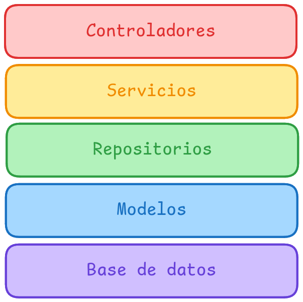

# 🌿 Trabajar en el backend

## Arquitectura

La arquitectura de Spring es muy clara y esta muy bien definida, se debe seguir a raja tabla.



En Spring usaremos una arquitectura dividida en capas. Cada capa solo puede llamar a la capa inferior (o a su misma capa en caso de ser un servicio), es decir un controlador NUNCA llamará a un repositorio.

### Base de datos

Aqui se guardan los datos, en nuestro caso es PostgreSQL, nunca tocamos la base de datos de manera directa.

### Modelos

Son una abstracción de las tablas de la base de datos.

### Repositorios

Interactuan con la base de datos, usaremos JPARepository. Se deben evitar fallos en esta capa a toda costa.

### Servicios

Aqui se gestiona **TODA** la lógica de negocio. Las excepciones deben ser lanzadas aqui como muy tarde para evitar errores en la base de datos. Los servicios pueden consultar a repositorios o a otros servicios (cuidado con las dependencias circulares).

Todos los servicios necesitan ser profundamente testeados.

### Controladores

Reciben las peticiones HTTP, es el punto de entrada y salida de nuestros datos de la aplicacion, deben llamar exclusivamente a servicios.

Todos los controladores necesitan ser testeados.

## Lombok

Se deben usar anotaciones de Lombok para evitar código boilerplate.

### Getter y Setter

Se deben usar `@Getter` y `@Setter` en vez de hacerlos a mano, a menos de que haya una razón para lo contrario.

```java
import lombok.Getter;
import lombok.Setter;

@Getter
@Setter
public class User {
    private String name;
    private String email;
}
```

### RequiredArgsConstructor

Se deben evitar hacer los constructores a mano en los Servicios y Controladores siendo remplazado por `@RequiredArgsConstructor`, aquellos servicios y repositorios injectados deben tener los modificadores `private final`.

```java
import lombok.RequiredArgsConstructor;
import org.springframework.stereotype.Service;

@Service
@RequiredArgsConstructor
public class UserService {

    private final UserRepository userRepository;

}
```

## Convenciones de nombres

### Tablas

El nombre de las tablas debe ser `snake_case`

```@Table(name = "outfit_tags")```


## Estructura de archivos

Se utiliza una estructura de archivos basada en módulos, en esta existe una carpeta `modules` y dentro de ella una carpeta para cada módulo. En esas carpetas hay carpetas para `models`, `repositories`,`services`,`controllers`,`dtos`,`exception`. Además hay una carpeta `common` para aquellas cosas que sean compartidas entre módulos. 
```
├── modules
│   ├── auth
│   │   ├── controllers
│   │   ├── dtos
│   │   ├── exceptions
│   │   ├── models
│   │   ├── repositories
│   │   └── services
│   ├── clients
│   │   ├── controllers
│   │   ├── dtos
│   │   ├── exceptions
│   │   ├── models
│   │   ├── repositories
│   │   └── services
│   ├── common
│   │   ├── exceptions
│   │   ├── models
│   │   └── validators
...
```


